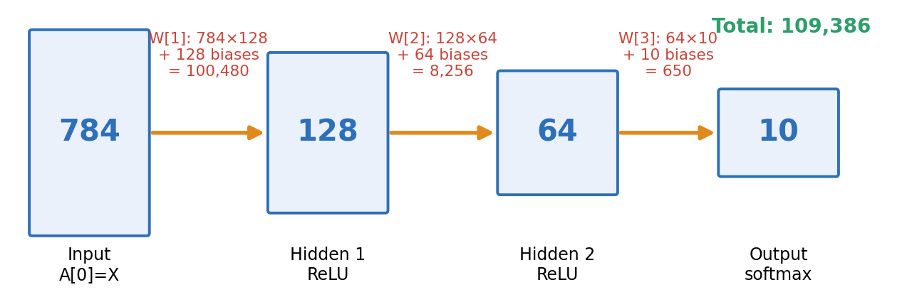

# 02 · Feed-Forward Networks and Backpropagation

From "how many parameters?" to "will it fit on 8 GPUs?" - a hands-on, NumPy-only walk through feed-forward neural networks and the backpropagation algorithm. Every concept is implemented from scratch, numerically verified, and visualised.

A full written explainer with equations, intuition, code and figures is in
**[`FFNN_Backpropagation_Guide.pdf`](FFNN_Backpropagation_Guide.pdf)** (8 pages).



## Learning path
| # | Topic | Core idea | Notebook |
|---|---|---|---|
| 01 | [Architecture and Parameter Counting](01%20-%20Architecture%20and%20Parameter%20Counting/) | params = `n_in*n_out + n_out` per layer | `01_architecture_and_parameter_counting.ipynb` |
| 02 | [Matrix-Form Forward Pass](02%20-%20Matrix-Form%20Forward%20Pass/) | `Z = A @ W + b`, `A = g(Z)` for a whole batch | `02_matrix_form_forward_pass.ipynb` |
| 03 | [Backprop for the Output Layer](03%20-%20Backprop%20for%20the%20Output%20Layer/) | softmax + CE gives `delta = (P - Y)/N` | `03_backprop_output_layer.ipynb` |
| 04 | [Backprop for Hidden Layers](04%20-%20Backprop%20for%20Hidden%20Layers/) | `delta[l] = (delta[l+1] W[l+1].T) * g'(Z[l])` | `04_backprop_hidden_layers.ipynb` |
| 05 | [Training a Small Network](05%20-%20Training%20a%20Small%20Network/) | mini-batch SGD + momentum on a spiral dataset | `05_training_a_small_network.ipynb` |
| 06 | [Memory Footprint and Multi-GPU Training](06%20-%20Memory%20Footprint%20and%20Multi-GPU%20Training/) | 16 bytes/param, data parallel, ZeRO | `06_memory_footprint_and_multi_gpu.ipynb` |

Work through them in order - each notebook reuses the ideas (and some code) of the previous one.

## Conventions used everywhere
- A batch is a matrix with **one row per sample**: `X` has shape `(N, d)`.
- `W[l]` has shape `(n_{l-1}, n_l)`, `b[l]` has shape `(n_l,)`; layers are numbered `1..L`, `A[0] = X`.
- Forward: `Z[l] = A[l-1] @ W[l] + b[l]`, `A[l] = g(Z[l])`.
- Loss is the **mean** over the batch, so the `1/N` lives inside `delta` at the output layer.
- Hidden activation: ReLU (He init); output: softmax + cross-entropy, unless stated otherwise.

## Quick start
```bash
pip install numpy matplotlib jupyter
jupyter notebook
```
All notebooks come with their outputs pre-rendered, use only NumPy + Matplotlib, and run in a few seconds on a laptop CPU.

## Folder structure
```
02 - Feed-Forward Networks and Backpropagation/
├── README.md
├── FFNN_Backpropagation_Guide.pdf
├── figures/
├── 01 - Architecture and Parameter Counting/      README.md + notebook
├── 02 - Matrix-Form Forward Pass/                 README.md + notebook
├── 03 - Backprop for the Output Layer/            README.md + notebook
├── 04 - Backprop for Hidden Layers/               README.md + notebook
├── 05 - Training a Small Network/                 README.md + notebook
└── 06 - Memory Footprint and Multi-GPU Training/  README.md + notebook
```

## Key results you will reproduce
- `[784, 128, 64, 10]` has **109,386** parameters (formula and real arrays agree).
- Matrix-form forward pass is ~1000x faster than loops.
- Analytic gradients match numerical ones to ~1e-10 on every layer.
- Sigmoid gradient norm drops by ~7 orders of magnitude over 10 layers; ReLU + He does not.
- A 2-64-64-3 MLP separates the 3-arm spiral with 100 % test accuracy.
- Data-parallel gradients equal single-device gradients to machine precision.

**Next section:** word embeddings (word2vec).
